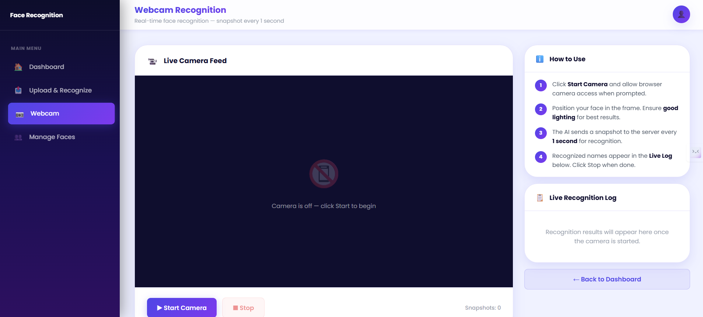

<a id="readme-top"></a>

<!-- BADGES -->
[](https://github.com/iprashanthvanam/face_recognition_system/stargazers)
[](https://github.com/iprashanthvanam/face_recognition_system/network/members)
[](https://github.com/iprashanthvanam/face_recognition_system/issues)
[](LICENSE)
[](https://python.org)
[](https://flask.palletsprojects.com)
[](https://opencv.org)
[](https://github.com/ageitgey/face_recognition)
[](https://iprashanthvanam.pythonanywhere.com)

---

<div align="center">

# 🤖 Integrated Face Recognition System
### A Web-Based Face Detection, Recognition & Management Platform

*Upload images, use your webcam live, use your recorded vides, add new faces, and retrain the model — all through a modern Flask web interface powered by dlib's 128-dimensional face encoding.*

<br/>

[](https://iprashanthvanam.pythonanywhere.com)
[](https://github.com/iprashanthvanam/face_recognition_system/issues/new?labels=bug)
[](https://github.com/iprashanthvanam/face_recognition_system/issues/new?labels=enhancement)

<br/>

<!-- HERO SCREENSHOT -->


> **Integrated Face Recognition System** — End-to-end face recognition pipeline: detect, encode, compare, and identify faces in real time

</div>

---

<!-- TABLE OF CONTENTS -->
<details>
  <summary>📑 Table of Contents</summary>
  <ol>
    <li><a href="#about-the-project">About The Project</a></li>
    <li><a href="#screenshots">Screenshots</a></li>
    <li><a href="#key-features">Key Features</a></li>
    <li><a href="#tech-stack">Tech Stack</a></li>
    <li><a href="#system-architecture">System Architecture</a></li>
    <li><a href="#how-face-recognition-works">How Face Recognition Works</a></li>
    <li><a href="#application-workflow">Application Workflow</a></li>
    <li><a href="#flask-routes">Flask Routes Reference</a></li>
    <li><a href="#venv-vs-system-level">Virtual Environment vs System-Level Install</a></li>
    <li><a href="#getting-started">Getting Started</a></li>
    <li><a href="#project-structure">Project Structure</a></li>
    <li><a href="#deployment-pythonanywhere">Deployment (PythonAnywhere)</a></li>
    <li><a href="#known-limitations">Known Limitations</a></li>
    <li><a href="#roadmap">Roadmap</a></li>
    <li><a href="#contributing">Contributing</a></li>
    <li><a href="#license">License</a></li>
    <li><a href="#contact">Contact</a></li>
    <li><a href="#acknowledgments">Acknowledgments</a></li>
  </ol>
</details>

---

## About The Project

Most face recognition systems are either buried in academic code with no usable interface, or locked inside expensive proprietary platforms. There is rarely a clean, open, self-hostable web application where anyone can register faces, retrain the model live, and run recognition in the browser — on both images and a live webcam.

**The Integrated Face Recognition System** solves this. It is a full-stack Flask application that wraps dlib's industry-proven face recognition pipeline in a clean, responsive web interface. Users can add people to the recognition database through the browser, instantly retrain face encodings without touching the code, recognize faces in uploaded images with bounding boxes and confidence scores, and run frame-by-frame live recognition through the webcam.

**Why this project?**

- ❌ **Old approach:** Running face recognition means writing Python scripts, managing models manually, and having no UI
- ✅ **Our approach:** A web interface wraps the entire pipeline — add faces, retrain, and recognize all from the browser
- 🎯 **Outcome:** A production-deployed, real-world face recognition system with persistent encodings, live webcam support, and multi-face detection in a single image

<p align="right">(<a href="#readme-top">back to top</a>)</p>

---

## Screenshots

A complete visual walkthrough of every screen in the system.

---

### 🏠 Home Page

<div align="center">
  
  <br/><br/>
  <sub><b>Landing page.</b> Navigation hub with links to Upload & Recognize, Webcam Recognition, and Manage Faces. Dark-themed glassmorphism UI with animated background.</sub>
</div>

---

### 📤 Upload & Recognize

<div align="center">
  
  <br/><br/>
  <sub><b>Image upload page.</b> Select any JPG/PNG image. The system detects all faces, draws bounding boxes (green = known, red = unknown), labels each face, and displays the recognition result with confidence distance score.</sub>
</div>

---

### 🔍 Image Recognition Result

<div align="center">
  
  <br/><br/>
  <sub><b>Recognition result.</b> Processed image with bounding boxes drawn around each detected face. Each face is labelled with the matched name and a distance score (lower = more confident). Unknown faces are marked in red.</sub>
</div>

---

### 📸 Webcam — Snapshot Recognition

<div align="center">
  
  <br/><br/>
  <sub><b>Webcam live recognition.</b> Browser accesses the camera via <code>getUserMedia</code>. Captures a frame every second and sends it to the server for recognition. Results displayed in real time below the video feed.</sub>
</div>

---

### 🎯 Webcam Recognition in Action

<div align="center">
  
  <br/><br/>
  <sub><b>Active webcam recognition.</b> Live recognition running — the server processes each snapshot, matches against the known faces database, and streams back the identified name and distance score.</sub>
</div>

---

### ➕ Add New Face

<div align="center">
  
  <br/><br/>
  <sub><b>Add a new person.</b> Enter a name and upload a clear face image. The system detects the face, saves it to the person's folder under <code>static/faces/</code>, and automatically retrains the pickle encodings file — no server restart needed.</sub>
</div>

---

<p align="right">(<a href="#readme-top">back to top</a>)</p>

---

## Key Features

### 🔍 Face Recognition Engine
- **128-dimensional face encoding** — dlib generates a 128-number vector per face, unique as a fingerprint
- **Multi-face detection** — detects and recognises multiple faces in a single image simultaneously
- **Distance-based confidence scoring** — every match returns a euclidean distance score (lower = more confident; threshold = 0.5)
- **Green/red bounding boxes** — OpenCV draws green boxes for known faces, red for unknown on the processed output image
- **Tolerance-tunable matching** — tolerance value configurable at recognition time

### 📷 Recognition Modes
- **Image Upload Recognition** — upload any JPG/PNG; get back a processed image with labelled bounding boxes
- **Webcam Snapshot Recognition** — browser captures a frame every second via `getUserMedia`, POSTs JPEG to server, displays result live
- **Video file processing** — `recognize_video_file()` processes every Nth frame (configurable frame skip) for video recognition

### 🗄️ Face Database Management
- **Add new person** — upload image + name, system validates face detected, saves to `static/faces/<name>/`, retrains immediately
- **Delete person** — removes the person's folder and retrains encodings
- **Manual retrain** — "Retrain Encodings" button rebuilds the pickle file from the entire `faces/` directory
- **Persistent storage** — face encodings stored as a `.pkl` pickle file; survives server restarts

### 🎨 UI & UX
- **Dark glassmorphism design** — deep navy background with teal accent, backdrop-filter blur, animated radial gradient
- **Fully responsive** — mobile-friendly layout, adaptive navigation, stacked buttons on small screens
- **Flash messaging** — user-friendly feedback on add / delete / retrain success or error
- **No page reload for webcam** — JavaScript fetch loop updates the recognition log without refreshing the page

<p align="right">(<a href="#readme-top">back to top</a>)</p>

---

## Tech Stack

| Layer | Technology | Purpose |
|-------|-----------|---------|
| **Backend** | Flask 3.0 (Python 3.11) | Web framework, routing, template rendering |
| **Face Recognition** | `face_recognition` 1.3.0 (dlib) | Face detection, 128D encoding, comparison |
| **Computer Vision** | OpenCV 4.10 (`cv2`) | Bounding box drawing, image/video processing |
| **Image Handling** | Pillow 10.4 | Fallback image loading and conversion |
| **Frontend** | HTML5, CSS3, Jinja2 | Templates with glassmorphism UI design |
| **Webcam API** | JavaScript `getUserMedia` | Browser-side camera capture, base64 JPEG stream |
| **Data Persistence** | Python `pickle` | Store and load face encoding dictionaries |
| **Deployment** | PythonAnywhere | Free Flask hosting with persistent filesystem |
| **Dev Server** | Flask built-in | `python app.py` for local development |

<p align="right">(<a href="#readme-top">back to top</a>)</p>

---

## System Architecture

```
┌────────────────────────────────────────────────────────────────────┐
│                    BROWSER (HTML / CSS / JS)                       │
│                                                                    │
│  Home  │  Upload & Recognize  │  Webcam  │  Manage Faces           │
│                                                                    │
│  Webcam Page:                                                      │
│  getUserMedia() → capture frame every 1s → base64 JPEG             │
│  → POST /recognize_webcam → display result in log div              │
└────────────────────────┬───────────────────────────────────────────┘
                         │  HTTP (Jinja2 templates + JSON API)
┌────────────────────────▼───────────────────────────────────────────┐
│                    FLASK BACKEND (app.py)                          │
│                                                                    │
│  /              → index()           Home page                      │
│  /upload        → upload_page()     Upload image → recognize       │
│  /uploads/<f>   → uploaded_file()   Serve processed images         │
│  /webcam        → webcam_page()     Webcam UI                      │
│  /recognize_webcam → recognize_webcam()  JSON API (POST)           │
│  /manage        → manage_page()     List all known faces           │
│  /add_face      → add_face()        Add person + retrain           │
│  /delete_face   → delete_face_route() Delete + retrain             │
│  /retrain       → retrain()         Force retrain encodings        │
└────────────────────────┬───────────────────────────────────────────┘
                         │
┌────────────────────────▼───────────────────────────────────────────┐
│              FACE RECOGNITION UTILS (face_recognition_utils.py)    │
│                                                                    │
│  encode_all_faces()      → scan faces/ dir → build encodings dict  │
│  recognize_image_file()  → detect faces → compare → draw boxes     │
│  recognize_frame()       → process single BGR frame (webcam)       │
│  recognize_video_file()  → process video frame-by-frame            │
│  add_face_from_file()    → validate + save + retrain               │
│  delete_face()           → remove dir + retrain                    │
│  load_encodings()        → read .pkl file                          │
│  save_encodings()        → write .pkl file                         │
└────────────────────────┬───────────────────────────────────────────┘
                         │
┌────────────────────────▼───────────────────────────────────────────┐
│                    FILESYSTEM                                      │
│                                                                    │
│  static/faces/                                                     │
│    ├── person_name_1/   (multiple training images)                 │
│    ├── person_name_2/                                              │
│    └── ...                                                         │
│                                                                    │
│  encodings.pkl          (pickled dict: {name: [128D vectors]})     │
│  static/uploads/        (uploaded + processed images, gitignored)  │
└────────────────────────────────────────────────────────────────────┘
```

<p align="right">(<a href="#readme-top">back to top</a>)</p>

---

## How Face Recognition Works

The system uses **dlib's ResNet-based 128-dimensional face encoding** pipeline:

```
Input Image
    │
    ▼
face_recognition.face_locations(image)
    │   HOG-based face detector finds bounding boxes
    ▼
face_recognition.face_encodings(image, locations)
    │   Deep neural network maps each face → 128-number vector
    ▼
face_recognition.compare_faces(known_encodings, face_encoding, tolerance=0.5)
    │   Euclidean distance between vectors
    │   distance < 0.5 → match  |  distance ≥ 0.5 → unknown
    ▼
face_recognition.face_distance(known_encodings, face_encoding)
    │   Returns exact distance for confidence scoring
    ▼
Best match index = argmin(distances)
    │   Closest known face wins
    ▼
Result: { name, distance, location }
```

### Encoding Storage Format

```python
# encodings.pkl structure
{
    "prashanth": [array_128d, array_128d, ...],   # multiple training images
    "pooja":     [array_128d, array_128d, ...],
    "kcr":       [array_128d],
    ...
}
```

Multiple training images per person improve accuracy — the system compares against all of them and picks the best match.

### Confidence Interpretation

| Distance | Confidence |
|----------|-----------|
| < 0.3 | Very high — near-identical |
| 0.3 – 0.5 | Good match — recognised |
| > 0.5 | Unknown — below threshold |

<p align="right">(<a href="#readme-top">back to top</a>)</p>

---

## Application Workflow

### 📤 Upload & Recognize Flow

```
User selects image → POST /upload
    → Save to static/uploads/
    → recognize_image_file(image_path, enc_path)
         → face_locations() → face_encodings()
         → compare_faces() → face_distance()
         → Draw bounding boxes with cv2.rectangle()
         → Label faces with cv2.putText()
         → Save processed image as .processed.jpg
    → Render result.html with processed image + results list
```

### 📸 Webcam Flow

```
Browser → getUserMedia() → access camera
    → setInterval(capture, 1000)  // every 1 second
    → canvas.toDataURL('image/jpeg', 0.8)  // base64 JPEG
    → POST /recognize_webcam  { "image": "data:image/jpeg;base64,..." }
         → Decode base64 → np.frombuffer → cv2.imdecode
         → recognize_frame(frame_bgr, enc_path)
         → Return JSON: { status, results: [{name, distance}] }
    → Display names + distances in log div
```

### ➕ Add Face Flow

```
User enters name + uploads image → POST /add_face
    → add_face_from_file(image_path, name, faces_dir, enc_path)
         → face_recognition.face_locations() — validate face exists
         → Save to static/faces/<name>/<name>_<filename>.jpg
         → encode_all_faces() — retrain ALL encodings
         → Save updated encodings.pkl
    → Flash success/error message → redirect to /manage
```

<p align="right">(<a href="#readme-top">back to top</a>)</p>

---

## Flask Routes

| Route | Method | Function | Description |
|-------|--------|----------|-------------|
| `/` | GET | `index()` | Home page |
| `/upload` | GET, POST | `upload_page()` | Upload image for recognition |
| `/uploads/<filename>` | GET | `uploaded_file()` | Serve processed result images |
| `/webcam` | GET | `webcam_page()` | Webcam recognition UI |
| `/recognize_webcam` | POST | `recognize_webcam()` | JSON API — process base64 frame |
| `/manage` | GET | `manage_page()` | List all known persons |
| `/add_face` | POST | `add_face()` | Add new person + retrain |
| `/delete_face` | POST | `delete_face_route()` | Delete person + retrain |
| `/retrain` | POST | `retrain()` | Force retrain all encodings |

<p align="right">(<a href="#readme-top">back to top</a>)</p>

---

## Virtual Environment vs System-Level Install

> This project was originally built directly on the system Python — no virtual environment. Here is a clear comparison to help you choose the right approach for your setup.

### ⚡ Quick Recommendation

**Always use a virtual environment.** It is the professional standard for any Python project, takes only 2 extra commands, and prevents every dependency conflict problem that makes face_recognition / dlib installations painful.

---

### Side-by-Side Comparison

| | Virtual Environment (`venv`) ✅ | System-Level (`pip install` directly) ⚠️ |
|---|---|---|
| **Isolation** | Dependencies are isolated — no conflict with other projects | All packages share one Python environment — conflicts guaranteed over time |
| **dlib / face_recognition** | Install specific tested versions safely | May conflict with dlib versions needed by other projects |
| **Reproducibility** | `requirements.txt` + `venv` = exact same environment every time | Works until another project or OS update breaks it |
| **Team / CI** | Everyone gets identical dependencies | "Works on my machine" problems |
| **PythonAnywhere** | Use `pip install --user` (no venv) or a virtualenv — both work | `pip install --user` is the PythonAnywhere-recommended approach |
| **Cleaning up** | Delete the `venv/` folder — done | `pip uninstall` each package manually |
| **Risk** | None | Risk of breaking other Python tools on your system |

---

### Install with Virtual Environment (Recommended)

```bash
# 1. Create the virtual environment
python -m venv venv

# 2. Activate it
# Linux / macOS:
source venv/bin/activate
# Windows:
venv\Scripts\activate

# 3. Install dependencies
pip install --upgrade pip
pip install -r requirements.txt

# 4. Run
python app.py
```

> Your terminal prompt will show `(venv)` while the environment is active. To deactivate: `deactivate`

---

### Install at System Level (Quick / No venv — original approach)

```bash
# Install directly to your system Python
pip install --upgrade pip
pip install -r requirements.txt

# Run
python app.py
```

> This works fine for solo development on a dedicated machine, but is **not recommended** for shared machines, CI/CD, or deployment. If dlib installation fails, see the [dlib troubleshooting section](#dlib-installation-troubleshooting) below.

<p align="right">(<a href="#readme-top">back to top</a>)</p>

---

## Getting Started

### Prerequisites

- **Python 3.8 – 3.11** (3.11 recommended — matches `runtime.txt`)
- **pip**
- **CMake** (required by dlib — see troubleshooting below)
- **Webcam** (optional — only needed for live recognition)

---

### Installation

**1. Clone the repository**

```bash
git clone https://github.com/iprashanthvanam/face_recognition_system.git
cd face_recognition_system
```

**2. Set up environment** (choose one option)

**Option A — Virtual Environment (recommended)**
```bash
python -m venv venv

# Linux / macOS
source venv/bin/activate

# Windows
venv\Scripts\activate
```

**Option B — System-level (original approach, no venv)**
```bash
# Skip this step — just install directly below
```

**3. Install dependencies**

```bash
pip install --upgrade pip
pip install -r requirements.txt
```

**4. (Optional) Pre-train face encodings**

If you already have images in `static/faces/`, you can pre-build the encodings:

```bash
python train_faces.py
```

This scans `static/faces/<person_name>/*.jpg` and generates `encodings.pkl`. You can also just use the web UI's "Retrain" button — same result.

**5. Run the application**

```bash
python app.py
```

Open your browser at `http://127.0.0.1:5000`

---

### dlib Installation Troubleshooting

`face_recognition` depends on `dlib` which requires a C++ compiler. This is the most common installation pain point.

**Windows:**
```bash
# Install CMake
winget install Kitware.CMake

# Install Visual C++ Build Tools from:
# https://visualstudio.microsoft.com/visual-cpp-build-tools/

# Or use the pre-compiled dlib binary from this repo's requirements.txt:
# dlib-bin==20.0.0  ← already uses pre-built wheels, no compilation needed
pip install dlib-bin==20.0.0
pip install face_recognition==1.3.0
```

**Linux:**
```bash
sudo apt-get install -y cmake build-essential
pip install face_recognition
```

**macOS:**
```bash
brew install cmake
pip install face_recognition
```

> **Note:** This project uses `dlib-bin==20.0.0` in `requirements.txt` which provides pre-compiled wheels — avoiding the need to compile dlib from source on most platforms.

<p align="right">(<a href="#readme-top">back to top</a>)</p>

---

## Project Structure

```
face_recognition_system/
├── images/                          # 📸 README screenshots
│   ├── Home page.png
│   ├── Upload and Recognize.png
│   ├── image recognition.png
│   ├── Webcam.png
│   ├── web cam recognition.png
│   ├── Manage faces.png
│   └── Add new faces.png
│
├── static/
│   ├── css/
│   │   └── style.css                # Base stylesheet
│   ├── faces/                       # Training images per person
│   │   ├── prashanth/               # Folder per person
│   │   ├── pooja/
│   │   ├── kcr/
│   │   └── ...
│   └── uploads/                     # Uploaded + processed images (gitignored)
│
├── templates/
│   ├── index.html                   # Home page
│   ├── upload.html                  # Upload & Recognize page
│   ├── result.html                  # Recognition result page
│   ├── webcam.html                  # Webcam snapshot recognition
│   └── manage.html                  # Manage faces page
│
├── app.py                           # Flask app — all routes
├── face_recognition_utils.py        # Core recognition engine
├── train_faces.py                   # CLI script to pre-train encodings
├── train.py                         # Legacy OpenCV DNN trainer (reference)
├── requirements.txt                 # Python dependencies
├── runtime.txt                      # Python version (python-3.11.9)
├── constraints.txt                  # Dependency constraints
├── .gitignore                       # Excludes venv/, uploads/, *.pkl
└── README.markdown
```

> **Note:** `encodings.pkl` is excluded from git via `.gitignore`. It is generated automatically when you add a face or run `python train_faces.py`.

<p align="right">(<a href="#readme-top">back to top</a>)</p>

---

## Deployment (PythonAnywhere)

The system is live at **[https://iprashanthvanam.pythonanywhere.com](https://iprashanthvanam.pythonanywhere.com)**

### Deployment Steps

**1. Upload the project**

```bash
# In PythonAnywhere Bash console
git clone https://github.com/iprashanthvanam/face_recognition_system.git
cd face_recognition_system
```

**2. Install dependencies**

```bash
# PythonAnywhere uses --user flag (no venv needed on PythonAnywhere)
pip install --user --upgrade pip
pip install --user -r requirements.txt
```

**3. Create a new Web App**

- Dashboard → **Web** tab → **Add a new web app**
- Choose: **Manual configuration** → **Python 3.11**

**4. Configure the WSGI file**

Edit `/var/www/yourusername_pythonanywhere_com_wsgi.py`:

```python
import sys

path = '/home/yourusername/face_recognition_system'
if path not in sys.path:
    sys.path.append(path)

from app import app as application
```

**5. Configure Static Files** (Web tab → Static files section)

| URL | Directory |
|-----|-----------|
| `/static/` | `/home/yourusername/face_recognition_system/static/` |

**6. Reload the web app**

Click **Reload** in the PythonAnywhere Web tab. Your app is live.

> **Important:** `encodings.pkl` is excluded from git. After deployment, go to your live app → Manage Faces → Retrain Encodings to generate the pickle file on the server.

<p align="right">(<a href="#readme-top">back to top</a>)</p>

---

## Known Limitations

- **Webcam recognition requires HTTPS** — browsers block `getUserMedia` on HTTP. Works on PythonAnywhere (HTTPS) but requires a TLS cert for self-hosted setups
- **dlib is CPU-only** — no GPU acceleration in this build; recognition speed depends on CPU. ~0.2–1s per frame on modern hardware
- **Single `.pkl` encoding file** — all encodings stored in one file; grows with more people but remains fast for typical use (< 100 people)
- **No authentication** — anyone with the URL can add/delete faces. Add Flask-Login if deploying publicly
- **File upload size limit** — Flask's default max content length applies; configure `MAX_CONTENT_LENGTH` in `app.config` for large images

<p align="right">(<a href="#readme-top">back to top</a>)</p>

---

## Roadmap

- [x] Image upload + multi-face recognition with bounding boxes
- [x] Webcam frame-by-frame live recognition
- [x] Add new person via web UI with instant retrain
- [x] Delete person from database
- [x] Manual retrain button
- [x] Distance-based confidence scoring
- [x] Responsive glassmorphism UI
- [x] Persistent pickle-based face encodings
- [x] PythonAnywhere deployment
- [ ] User authentication (Flask-Login) — protect add/delete operations
- [ ] Multiple images per person during add (batch upload for better accuracy)
- [ ] Real-time video stream recognition (continuous frame overlay, not just snapshots)
- [ ] Confidence threshold configurable from UI
- [ ] Recognition history log with timestamps
- [ ] Export recognized face report (CSV / PDF)
- [ ] REST API endpoints for external integration
- [ ] Docker container for one-command local setup
- [ ] GPU acceleration support (dlib CUDA build)

See the [open issues](https://github.com/iprashanthvanam/face_recognition_system/issues) for the full list.

<p align="right">(<a href="#readme-top">back to top</a>)</p>

---

## Contributing

Contributions are what make open-source great. Any contributions are **greatly appreciated**.

1. Fork the project
2. Create your feature branch (`git checkout -b feature/AmazingFeature`)
3. Commit your changes (`git commit -m 'Add some AmazingFeature'`)
4. Push to the branch (`git push origin feature/AmazingFeature`)
5. Open a Pull Request

Please keep functions in `face_recognition_utils.py` pure (no Flask dependencies) and Flask routes thin in `app.py`. For significant changes, open an issue first to discuss the approach.

<p align="right">(<a href="#readme-top">back to top</a>)</p>

---

## License

Distributed under the MIT License. See `LICENSE` for more information.

<p align="right">(<a href="#readme-top">back to top</a>)</p>

---

## Contact

<div align="center">

### Prashanth Vanam

<p>
  <a href="mailto:prashanthvanamnetha@gmail.com">
    
  </a>
  &nbsp;
  <a href="https://www.linkedin.com/in/iprashanthvanam/">
    
  </a>
  &nbsp;
  <a href="https://github.com/iprashanthvanam">
    
  </a>
</p>

<p>
  
  &nbsp;
  
</p>

</div>

<br/>

| | |
|---|---|
| 📧 **Email** | [prashanthvanamnetha@gmail.com](mailto:prashanthvanamnetha@gmail.com) |
| 💼 **LinkedIn** | [linkedin.com/in/iprashanthvanam](https://www.linkedin.com/in/iprashanthvanam/) |
| 🐙 **GitHub** | [github.com/iprashanthvanam](https://github.com/iprashanthvanam) |
| 📍 **Location** | Hyderabad, Telangana, India |
| 📞 **Mobile** | +91 703 6142 499 |

<br/>

> 💬 Feel free to reach out for collaborations, questions, or just to say hi!

**Project Link:** [https://github.com/iprashanthvanam/face_recognition_system](https://github.com/iprashanthvanam/face_recognition_system)

<p align="right">(<a href="#readme-top">back to top</a>)</p>

---

## Acknowledgments

- [face_recognition](https://github.com/ageitgey/face_recognition) by Adam Geitgey — the Python wrapper around dlib that makes face recognition accessible
- [dlib](http://dlib.net/) by Davis King — the underlying C++ machine learning library with the ResNet face encoder
- [OpenCV](https://opencv.org/) — image and video frame processing, bounding box drawing
- [Flask](https://flask.palletsprojects.com/) — lightweight Python web framework
- [Pillow](https://pillow.readthedocs.io/) — Python imaging library for fallback image handling
- [PythonAnywhere](https://www.pythonanywhere.com/) — free Flask hosting with persistent filesystem
- [Google Fonts — Inter](https://fonts.google.com/specimen/Inter) — primary typeface for the UI

<p align="right">(<a href="#readme-top">back to top</a>)</p>

---

<div align="center">

Built with ❤️ for computer vision enthusiasts 🤖

⭐ Star this repo if the Integrated Face Recognition System helped you!

</div>
